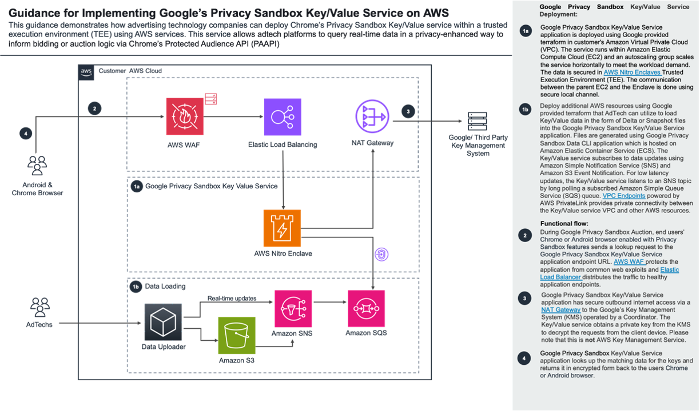
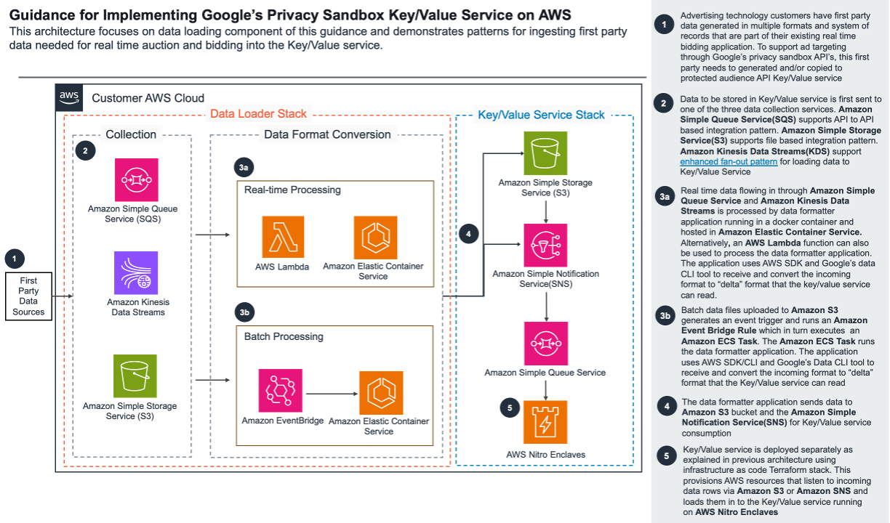
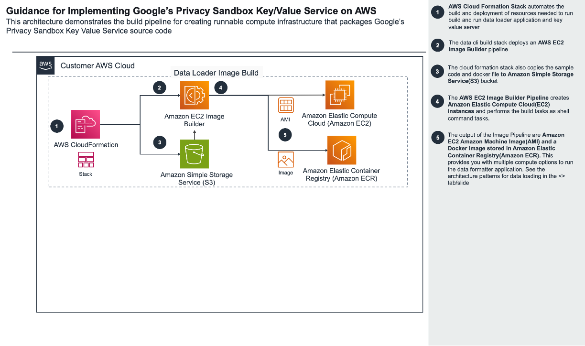
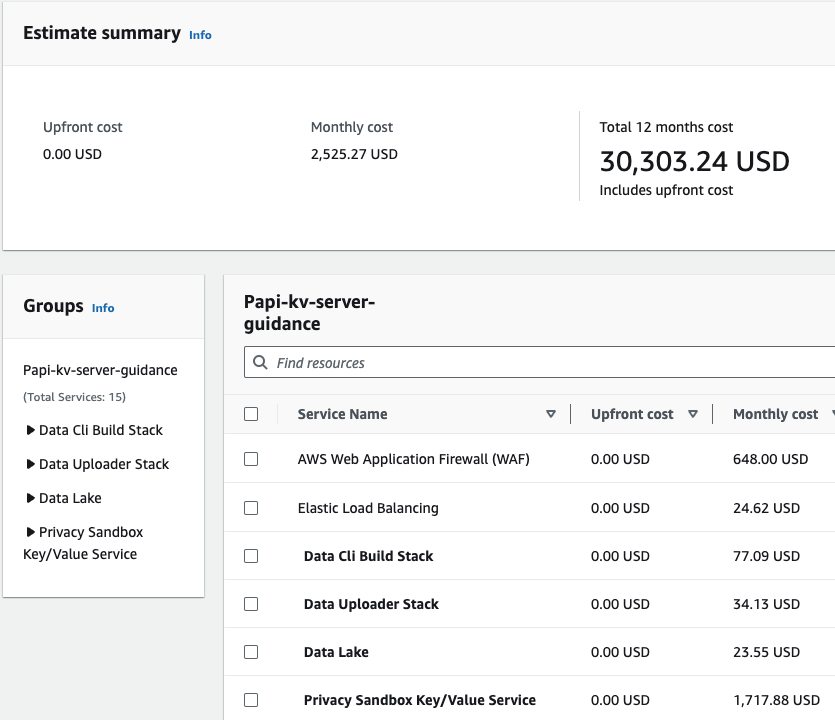

# Guidance for implementing Google's Privacy Sandbox Key/Value Service on AWS

## Table of Content

1. [Overview](#overview)
    - [Cost](#cost)
2. [Prerequisites](#prerequisites)
    - [Operating System](#operating-system)
3. [Deployment Steps](#deployment-steps)
4. [Deployment Validation](#deployment-validation)
5. [Running the Guidance](#running-the-guidance)
6. [Next Steps](#next-steps)
7. [Cleanup](#cleanup)
8. [FAQ, known issues, additional considerations, and limitations](#faq-known-issues-additional-considerations-and-limitations)
9. [Revisions](#revisions)
10. [Notices](#notices)
11. [Authors](#authors)

## Overview
This guide walks you through the deployment of the data loader stack. This stack is part of the overall Guidance for Implementing Google Chrome's Privacy Sandbox Key Value Service on AWS. It automates the infrastructure build required to ingest data in to Key Value Server


### Architecture Overview
#### Key Value Server Architecture

#### Data flow architecture

#### Code Build architecture

This stack deploys five sub stacks
1. VPC Stack - Creates a new stack or use an existing VPC resource based on input through cdk context
2. S3 Stack - Creates S3 buckets based on inputs.
    1. Input S3 bucket - where the existing first party data will land
    2. Output S3 bucket - If an input is given, the stack will look for that resource and use it. WIll reuse the input bucket
3. Data CLI build stack - Deploys two software build pipeline options
    1. A stepfunction workflow that launches an EC2 instance to build Data CLI tool container and a container packaged with Data cli tool and AWS CLI to complete the data formatter application package
    2. An imagebuilder pipeline that builds an AMI and container images that package the data formatter applicaton. 
4. Data formater application stack. The stack deploys an example data processing workflow S3(input bucket) -> EventBridge -> ECS -> S3(output bucket/ bucket from the terraform stack). The stack can build one of the below container image based on inputs
    1. An AWS CLI based container
    2. A pyhon SDK based container - This option is selected by default because the size of the container image is less compared to AWS CLI based image (40mb vs 240mb)
5. WAF stack - deploys web application firewall rules that inspects the incoming traffic from chrome browser to the ELB front ending the Key value server
### Cost

_You are responsible for the cost of the AWS services used while running this Guidance. As of May 2024, the cost for running this Guidance with the default settings in the N. Virginia  is approximately $2,525 per month for processing 1b real time requests on the Key value server and running 1 minute batches of data upload from S3._
_Refer this [AWS Cost Calculator](https://calculator.aws/#/estimate?id=e4da3eccca5699934227d6939f1576c79de1e8be) for assumptions used in the estimation._
## Prerequisites

### Operating System

The project code uses the Python version of the AWS CDK ([Cloud Development Kit](https://aws.amazon.com/cdk/)). To execute the project code, please ensure that you have fulfilled the [AWS CDK Prerequisites for Python](https://docs.aws.amazon.com/cdk/latest/guide/work-with-cdk-python.html). Steps for a macOS machine is captured here.  Deployment in another OS may require additional steps.

1. Install homebrew
```
/bin/bash -c "$(curl -fsSL https://raw.githubusercontent.com/Homebrew/install/HEAD/install.sh)"
```
2. Install Python
```
brew install python
```
3. Install Git client
```
brew install git
```
4. Install AWS CLI
```
brew install awscli
```
5. Create CLI credentials using IAM in AWS console and Configure CLI profiles
```
aws configure --profile <profile name>
```

### Third-party tools
#### Google Chrome Privacy Sandbox Protected Audience API CLI Tool
This stack packages the [Data CLI tool](https://github.com/privacysandbox/protected-auction-key-value-service/blob/release-0.16/docs/data_loading/loading_data.md) developed by Google to convert incoming data in to the format key value server can ingest.

### Python Dependencies
Review [requirements.txt](./requirements.txt) for the python dependencies

### AWS account requirements
The stack requires input parameters that includes the S3 bucket that the Key value server listens to for ingesting data. Deploy the [terraform stack](https://github.com/privacysandbox/protected-auction-key-value-service/blob/release-0.16/docs/deployment/deploying_on_aws.md) and capture the S3 bucket name.


### AWS CDK bootstrap

The project code requires that the AWS account is [bootstrapped](https://docs.aws.amazon.com/de_de/cdk/latest/guide/bootstrapping.html) in order to allow the deployment of the CDK stack. Bootstrap CDK on the CLI profile you created earlier
```
cdk bootstrap --profile <profile name>
```

### Service limits
NA

### Supported Regions
All regions where the component services used in the stack are available.

## Deployment Steps
__Important__: Follow the [Key/Value Server setup instructions](./KV_Server_setup.md) in order to set up the AWS infrastructure and to run the Key/Value server.

1. Clone this repository to your development desktop
```
git clone git@github.com:aws-solutions-library-samples/guidance-for-impelementing-google-chromes-privacy-sandbox-key-value-server.git
```
2. Use [envsetup.sh](./envsetup.sh) to setup virtual environment and install python dependencies

3. Create a [cdk.context.json](cdk.context.json) file. A example [cdk.context.json.example](cdk.context.json.example)is available in the repo 
    1. Update the parameters as required
```
{
    "build-infra": "imagebuilder", # Required imagebuilder/stepfunction/all
    "build-instance-type": "m3.large", # Required, keep this default. This is only used in the stepfunction stack in this version
    "cli-compute": "ecs", # Required ec2/ecs/lambda/all
    "elb-arn":"my-elb-arn", # Required ARN of the ELB from Key/Value Server setup instructions.
    "input-bucket-pfx": "mybucket", # Optional Give only the prefix following s3 naming standards. This will be appended with account and region generate unique bucket url. If this input is not given, stack will generate a unique name.
    "output-bucket-name": "mybucketname", # Optional name of the bucket that is created by terraform stack. If this input is not given, input bucket is used as output bucket.
    "output-key":"output", # Optional key in bucket that is created by terraform stack where key value server listens to incoming files. If this input is not given, stack will use defaults
    "input-key":"input", # S3 path key where the inputfiles CSV will land. If this input is not given, stack will use defaults
    "vpc-id":"myvpc" # Optional VPC id from the terraform stack. If this input is not given, stack creates new vpc.
    "alb-arn":"my-alb-arn" # ARN of the ALB from Key/Value Server setup instructions.
}

 ```
 * cli-compute - This stack provides multiple copute options for running data format conversion. ECS is recommended to handle large batches of data and horizontal scaling.
 * build-infra - One component of this stack stack builds the data cli container image. This data cli build stack supports two options - "imagebuilder" and "stepfunction". Using imagebuilder is recommended.

5. Review the infrastructure components being deployed
```
# vpc stack
cdk synth papi_vpc --profile=<profile name>
# s3 stack
cdk synth s3_stack --profile=<profile name>
# data cli build stack
cdk synth data_cli_build_stack --profile=<profile name>
# data loader stack
cdk synth data_loader_stack--profile=<profile name>
# all
cdk synth --profile=<profile name>
```
6. Deploy the workflow sample code and related AWS services used in the Entity resolution workflow
```
# vpc stack
cdk deploy papi_vpc --profile=<profile name>
# s3 stack
cdk deploy s3_stack --profile=<profile name>
# data cli build stack - depends on s3 and vpc stack
cdk deploy data_cli_build_stack --profile=<profile name>
# data loader stack - depends on data cli build stack
cdk deploy data_loader_stack--profile=<profile name>
# all
cdk deploy --profile=<profile name>
```

## Deployment Validation

* Open CloudFormation console and verify the status of the template with the name starting with stack.
* If deployment is successful, you should see below resources in the console.
    1. S3 buckets
    2. EventBridge Rule connecting S3 buckets to ECS tasks
    3. ECS cluster and associated resources
    4. ECR Repo
    5. Imagebuilder Pipeline and resources
    6. Stepfunction statemachine
    7. IAM roles

## Running the Guidance

### Guidance inputs

1. Locate the image builder pipeline or stepfunction to build the data formatter application container image and run it. This could take up to 2 hrs to complete
2. Verify that there is an AMI and three container images tags published in the ECR repo
3. Upload the sample data.csv in to the input data bucket/input folder in S3. This will run the Event bridge rule, and launch an ECS task that does the data format conversion
4. Check the ECS task logs. You will need to use the filter "All Statuses" in the console to see the past executions. Usually this execution should complete within 30 seconds of the file upload. Run time could vary based on the file size

### Expected output
You should be able to see a new file with pattern ```<input_filename>_DELTA``` in the output s3 bucket/key
### Output description
The output file is in the format 
## Next Steps
Test if the ingested key values made it to the key value server by running get api calls on the key value server

## Cleanup

1. When you’re finished experimenting with this solution, clean up your resources by running the command:

```
# data collection stack
cdk destroy papi_vpc --profile=<profile name>
# s3 stack
cdk destroy s3_stack --profile=<profile name>
# data cli build stack - depends on s3 and vpc stack
cdk destroy data_cli_build_stack --profile=<profile name>
# data loader stack - depends on data cli build stack
cdk destroy data_loader_stack--profile=<profile name>
# all
cdk destroy --profile=<profile name>
```
2. Manually delete the container images and the container repo from ECR


## FAQ, known issues, additional considerations, and limitations

**Known issues**
- While running cdk destroy the ECR Container images and the repo are not removed by default. This might result in cdk error on re-deployment in to the same account. Delete the images manually
- Imagebuilder resources if changed in the CDK, version increments needs to be explicitly added to the the resource definition. CDK could fail otherwise on update deployments
- Certain instance types in the input for infrastructure config of imagebuilder pipeline may result in cpu architecture conflict with the parent_image option in image recipe config. For example m3.large and arn:aws:imagebuilder:{region}:aws:image/ubuntu-server-22-lts-arm64/x.x.x have conflicts

**Additional considerations**
- The AWS CLI container image size could be optimized further by using light weight ubuntu/debian images. Edit the docker files as required to optimize further. The Python SDK is using Distroless image as base and has been observed to be having the smallest size
- The eventbridge rule configured by the stack expects a .csv suffix. Change stack as required
- Use [privacy sandbox benchmark testing tool](https://github.com/privacysandbox/protected-auction-key-value-service/blob/release-0.16/docs/data_loading/data_loading_capabilities.md#benchmarking-tool) to generate higher volumes of data to test the performance of this stack
- This stack is intented to be run as is in a Dev/Sandbox environment. Modify the stack and apply your security and business continuity best practices in production
- For any feedback, questions, or suggestions, please use the issues tab under this repo.

## Revisions


## Notices

*Customers are responsible for making their own independent assessment of the information in this Guidance. This Guidance: (a) is for informational purposes only, (b) represents AWS current product offerings and practices, which are subject to change without notice, and (c) does not create any commitments or assurances from AWS and its affiliates, suppliers or licensors. AWS products or services are provided “as is” without warranties, representations, or conditions of any kind, whether express or implied. AWS responsibilities and liabilities to its customers are controlled by AWS agreements, and this Guidance is not part of, nor does it modify, any agreement between AWS and its customers.*

## Authors

- Ranjith Krishnamoorthy
- Thyag Ramachandran
